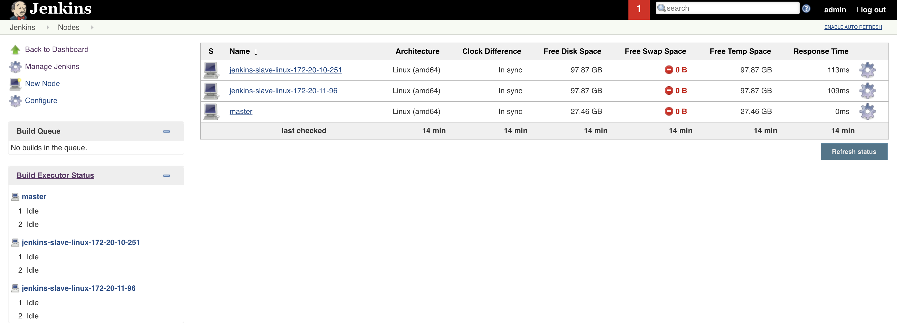
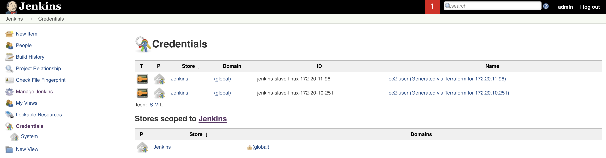

# jenkins-cluster-setup

Using Packer and Terraform to Setup Jenkins Master-Slave Architecture

- VPC Setup with Terraform (S3 and DynamoDB Backend for State Management)
- Jenkins Master/Slave AMI Creation with Packer
- Jenkins Master EC2 Instance Creation (SG, IAM and others)
- Jenkins Slave AutoScaling Group (SG, IAM and others)
- Attach Jenkins Node to Master and Install most of the required plugins

# Architecture


# Prerequisite

- [Configuring the AWS CLI - AWS Command Line Interface](https://docs.aws.amazon.com/cli/latest/userguide/cli-chap-configure.html)
- Create private and public SSH keys

```bash
cd ~/.ssh/; ssh-keygen -t rsa -m PEM -C "Jenkins master key" -f "jenkinsMaster_rsa"
cd ~/.ssh/; ssh-keygen -t rsa -m PEM -C "Jenkins agent key" -f "jenkinsAgent_rsa"
``` 

# Creating Setup

```bash
./setup.sh
```

# Destroying Setup

```bash
./destroy.sh
```

# Jenkins AMI

```
...
==> amazon-ebs: Creating AMI tags
    amazon-ebs: Adding tag: "Tool": "Packer"
    amazon-ebs: Adding tag: "Author": "nchotai"
...
==> Builds finished. The artifacts of successful builds are:
--> amazon-ebs: AMIs were created:
eu-west-1: ami-0fc1d54f3e6867f97
```

# Outcome



